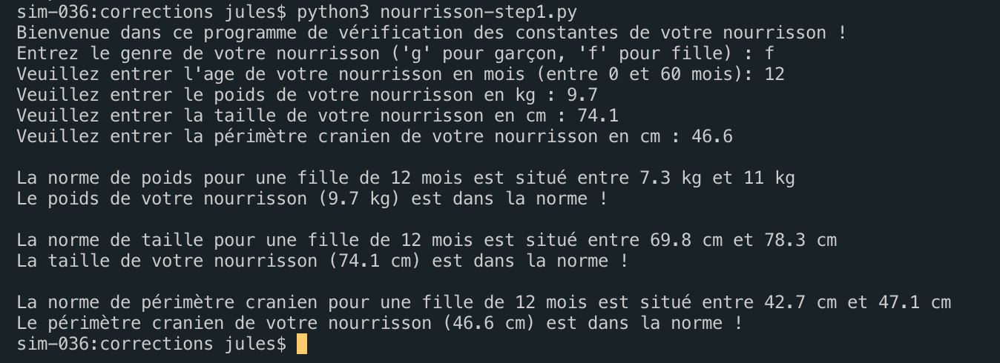
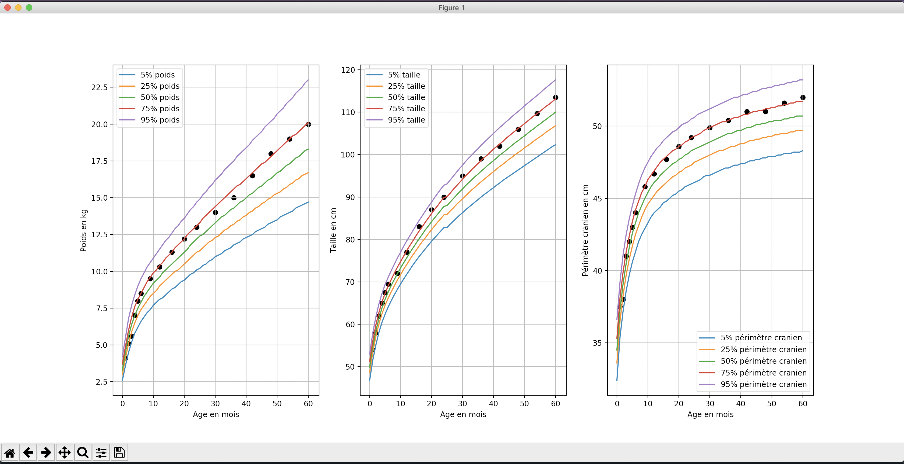

# Mini projet python Track my baby

Ce projet en deux étapes a pour but de suivre l'évolution des constantes d'un nourrisson entre 0 et 60 mois. Le projet est documenté sur Simplonline dans [ce brief projet](https://simplonline.co/briefs/detail/fEPoCouyRST8fqodg).

Il conviendra d'utiliser `pip` pour importer les librairies nécessaires sur son poste de travail.

## Attendu pour l'étape 1



## Attendu pour l'étape 2



## Résultats

### Point à retenir

l'import de variables externes au script :
Dans le fichier .py principal, pour accéder aux variables d'un autres fichier .py, il faut ajouter la commande **import** avant d'utiliser les variables en y ajoutant le nom du fichier externe.
L'appel à la variable se fait en préfixant la variable par le nom du fichier externe.
```python
import fichier_externe
...
# Appel à la variable externe
fichier_externe.ma_variable
...
```

## Ressources externes utilisées

### Step 1

Teste si une chaine est contenu dans une autre :

https://www.afternerd.com/blog/python-string-contains/

Import des variables externes au script :

http://indexerror.net/5260/visibilit%C3%A9-des-variables-entre-modules

### Step 2

Utilisation de la librairie MatPlotLib :

http://www.python-simple.com/python-matplotlib/pyplot.php

https://matplotlib.org/3.1.0/api/pyplot_summary.html

https://matplotlib.org/3.1.0/api/colors_api.html#module-matplotlib.colors

Utilisation des Dictonnaries :

https://docs.python.org/fr/3/tutorial/datastructures.html paragraphe 5.5
